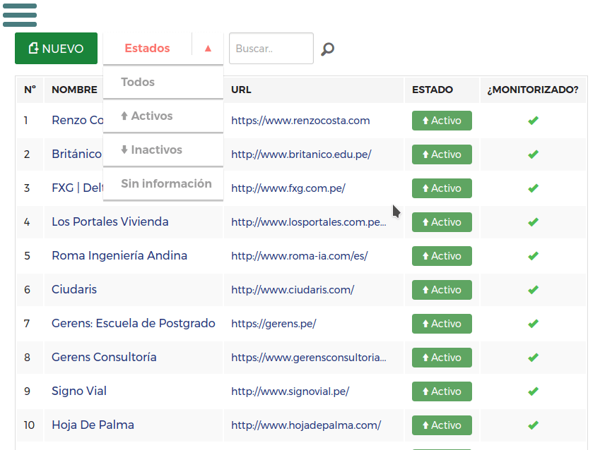

# README #

### Proyecto: django-uptime-monitor ###

Aplicación web en django que permite monitorizar el estado de los sitios web registrados ejecutando request del tipo HEAD.


### Requerimientos ###

1. Python 3
2. Postgresql (o una base de datos compatible con django)
3. Redis

### Configuración ###

El proyecto está diseñado para requerir una configuración mínima, los pasos a seguir en resumen son:

1. Clonar el repositorio.

2. Instalar las dependencias:

      ```
      pip install -r requirements.txt
      ```

3. El proyecto utiliza *Postgresql* como base de datos principal y *Redis* para el manejo de las colas. Ambos configurables desde los archivos settings.py y settings.json.

4. Aplicar las migraciones y crear el superusuario:

      ```
      ./uptime/manage.py migrate
      
      ./uptime/manage.py createsuperuser
      ```

5. Iniciar el worker y el scheduler para django-rq:

      ```
      ./uptime/manage.py rqworker
      ./uptime/manage.py rqscheduler
      ```

7. Iniciar django.

      ```
      ./uptime/manage.py runserver
      ```

### Licencia ###

Ver archivo LICENSE


### Screenshots ###

#### Dashboard ####


#### Menú ####


#### Proyectos ####

